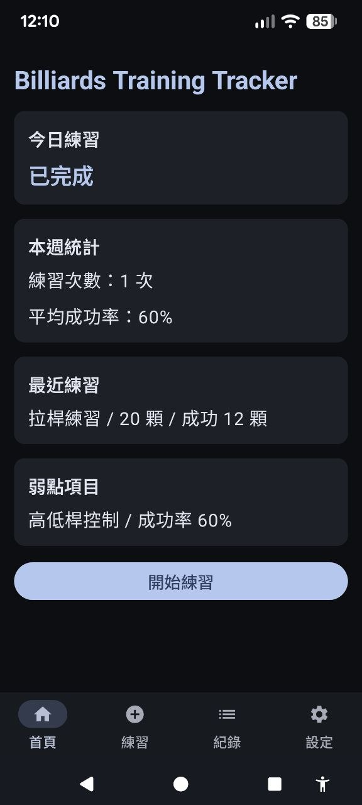
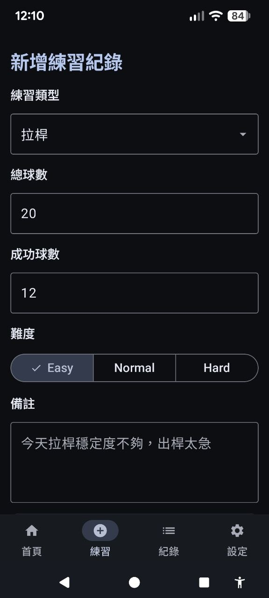
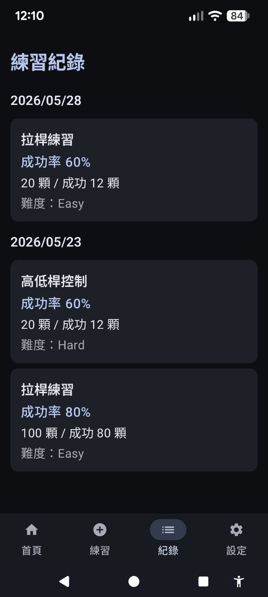

# Billiards Training Tracker

Modern Android practice tracking application for billiards training.

Built with Kotlin, Jetpack Compose, MVVM architecture, Room database, and Material3.

---

## Features

* Practice session tracking
* Success rate statistics
* Training history records
* Material3 dark mode support
* Local persistence with Room
* Modern Android architecture

---

## Screenshots

| Dashboard                               | Practice                              | Records                             |
|-----------------------------------------|---------------------------------------|-------------------------------------|
|  |  |  |

---

## Tech Stack

* Kotlin
* Jetpack Compose
* Material3
* MVVM Architecture
* StateFlow
* Room Database
* Navigation Compose
* Coroutines

---

## Architecture

This project follows MVVM architecture:

* UI layer built with Jetpack Compose
* ViewModel for UI state management
* StateFlow for reactive state updates
* Room for local data persistence
* Navigation Compose for screen navigation

---

## Project Structure

```text
app/
├── ui/
├── viewmodel/
├── data/
├── navigation/
├── database/
└── theme/
```

---

## UI

* Material3 design
* Dark mode support
* Responsive Compose UI

---

## Purpose

This project was built as a modern Android development portfolio project,
focusing on Jetpack Compose and modern Android architecture.

---

## Author

Asiz Tsai
